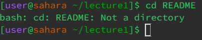

# Lab Report 1
## `cd` with no arguments
 
working directory is `/home` 
Having no arguments didn't point to any directory for the `cd` command to open, so nothing happened 
It is not an error 

## `cd lecture1` where `lecture1` is a directory
 
working directory is `/home` 
`lecture1` is a directory that the `cd` command was directed to open, and this is what the command did 
Not an error 

## `cd README` where `README` is a file
 
working directory is `/home/lecture1` 
`README` is a file and the `cd` command can't take a file as an argument 
It is an error because `cd` isn't supposed to take files as arguments, just links to other directories within it<be>

## `ls` with no arguments
 
working directory is `/home` 

## `ls lecture1` where `lecture1` is a directory
 
working directory is `/home` 

## `ls en-us.txt` where `en-us.txt` is a file
 
working directory is `/home/lecture1/messages` 

## `cat` with no arguments
 
working directory is `/home` 

## `cat lecture1` where `lecture1` is a directory
 
working directory is `/home` 

## `cat README` where `README` is a file
 
working directory is `/home/lecture1` 
