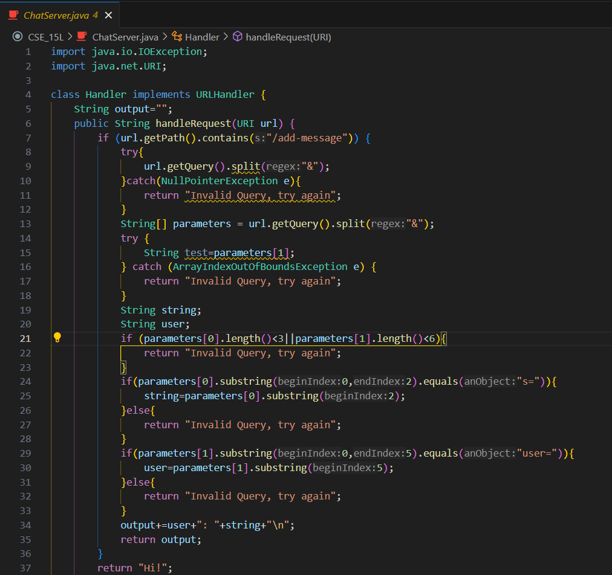
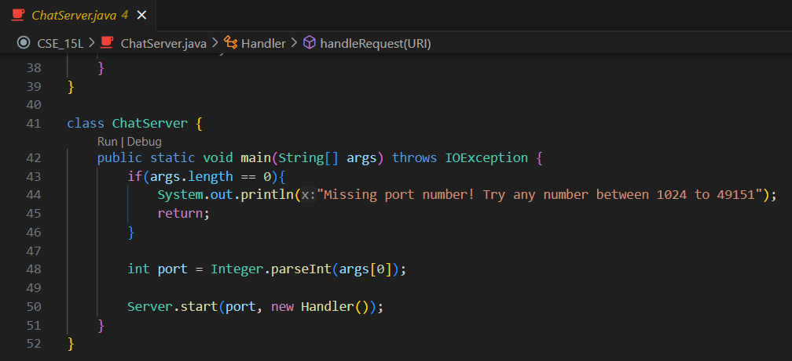
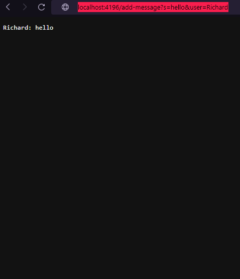
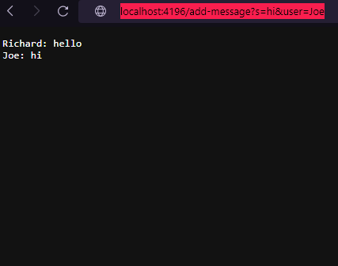

# Lab Report 1
## Part 1 

 
* The `handleRequest` method is called when I use the `add-message` query
* Arguments are `/add-message`, and the query is split into 2 args being `s=hello` and `user=Richard`. There are also multiple fields within the class like `output`, `parameters`, `test`, `string`, and `user`.
* `parameters` is initialized as `{"s=hello", "user=Richard"}`. `test` is initialized with the value `"user=Richard"`. `string` is set to `"hello"`. `user` is set to `"Richard"`. `output` is set to `"Richard: hello"` with a next line added on to the end. These fields got changed based on if they passed different conditions throughout the code where this case was a successful run of the code. 
 
* The `handleRequest` method is called when I use the `add-message` query
* Arguments are `/add-message`, and the query is split into 2 args being `s=hello` and `user=Richard`. There are also multiple fields within the class like `output`, `parameters`, `test`, `string`, and `user`.
* `parameters` is initialized as `{"s=hi", "user=Joe"}`. `test` is initialized with the value `"user=Joe"`. `string` is set to `"hi"`. `user` is set to `"Joe"`. `output` is set to `"Joe: hi"` with a next line added on to the end. These fields got changed based on if they passed different conditions throughout the code where this case was a successful run of the code. 

## Part 2 

Using the command line, show with ls and take screenshots of:

The absolute path to the private key for your SSH key for logging into ieng6 (on your computer, an EdStem workspace, or on the home directory of the lab computer)
The absolute path to the public key for your SSH key for logging into ieng6 (this is the one you copied to your account on ieng6, so it should be a path on ieng6's file system)
A terminal interaction where you log into your ieng6 account without being asked for a password.
