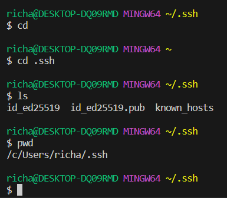
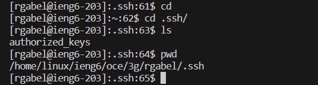
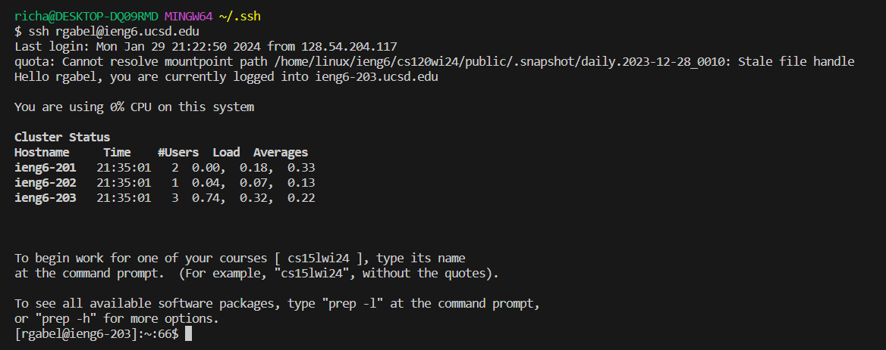

# Lab Report 1
## Part 1 

 
* The `handleRequest` method is called when I use the `add-message` query
* Arguments are `/add-message`, and the query is split into 2 args being `s=hello` and `user=Richard`. There are also multiple fields within the class like `output`, `parameters`, `test`, `string`, and `user`.
* `parameters` is initialized as `{"s=hello", "user=Richard"}`. `test` is initialized with the value `"user=Richard"`. `string` is set to `"hello"`. `user` is set to `"Richard"`. `output` is set to `"Richard: hello"` with a next line added on to the end. These fields got changed based on if they passed different conditions throughout the code where this case was a successful run of the code. 
 
* The `handleRequest` method is called when I use the `add-message` query
* Arguments are `/add-message`, and the query is split into 2 args being `s=hello` and `user=Richard`. There are also multiple fields within the class like `output`, `parameters`, `test`, `string`, and `user`.
* `parameters` is initialized as `{"s=hi", "user=Joe"}`. `test` is initialized with the value `"user=Joe"`. `string` is set to `"hi"`. `user` is set to `"Joe"`. `output` is set to `"Joe: hi"` with a next line added on to the end. These fields got changed based on if they passed different conditions throughout the code where this case was a successful run of the code. 

## Part 2 
 
The absolute path for the private SSH key is `/c/Users/richa/.ssh/id_ed22519.file` 
 
The absolute path for the public SSH key is `/home/linux/ieng6/oce/3g/rgabel/.ssh/authorized_keys.file` 
  

## Part 3 
I learned about remotely connecting to another computer system. I've always known that remote connect was a thing that existed on Windows OS but I never knew it could be easily done with a command line and that I could connect to a Linux-based system like the ieng6 one we connect to. I also didn't know about setting up keys to make logging into a remote connection easier.
