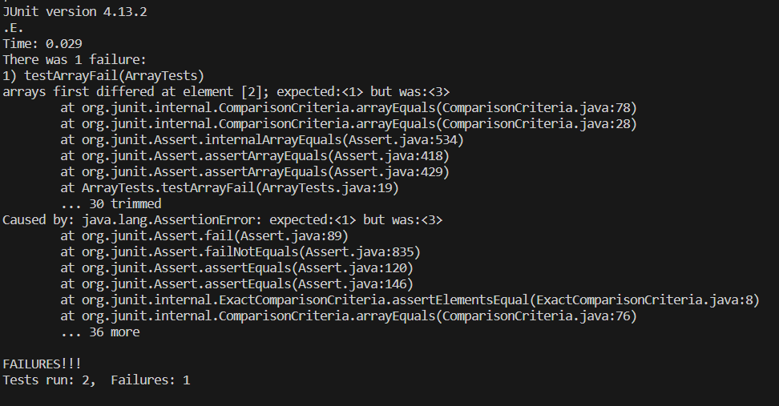

# Part 1
## Fail Test
### Test
```
@Test
public void testArrayFail(){
   int[] input2 = { 1, 2, 3 };
   ArrayExamples.reverseInPlace(input2);
   assertArrayEquals(new int[]{ 3, 2, 1 }, input2);
}
```
### Output
```
JUnit version 4.13.2
.E
Time: 0.026
There was 1 failure:
1) testArrayFail(ArrayTests)
arrays first differed at element [2]; expected:<1> but was:<3>
        at org.junit.internal.ComparisonCriteria.arrayEquals(ComparisonCriteria.java:78)
        at org.junit.internal.ComparisonCriteria.arrayEquals(ComparisonCriteria.java:28)
        at org.junit.Assert.internalArrayEquals(Assert.java:534)
        at org.junit.Assert.assertArrayEquals(Assert.java:418)
        at org.junit.Assert.assertArrayEquals(Assert.java:429)
        at ArrayTests.testArrayFail(ArrayTests.java:19)
        ... 30 trimmed
Caused by: java.lang.AssertionError: expected:<1> but was:<3>
        at org.junit.Assert.fail(Assert.java:89)
        at org.junit.Assert.failNotEquals(Assert.java:835)
        at org.junit.Assert.assertEquals(Assert.java:120)
        at org.junit.Assert.assertEquals(Assert.java:146)
        at org.junit.internal.ExactComparisonCriteria.assertElementsEqual(ExactComparisonCriteria.java:8)
        at org.junit.internal.ComparisonCriteria.arrayEquals(ComparisonCriteria.java:76)
        ... 36 more

FAILURES!!!
Tests run: 1,  Failures: 1
```
## Pass Test
### Test
```
@Test 
public void testArrayPass() {
   int[] input1 = { 3 };
   ArrayExamples.reverseInPlace(input1);
   assertArrayEquals(new int[]{ 3 }, input1);
}
```
### Output
```
JUnit version 4.13.2
.
Time: 0.035

OK (1 test)
```
## Symptom
<br>
## Bug
### Before
```
static void reverseInPlace(int[] arr) {
   for(int i = 0; i < arr.length; i += 1) {
      arr[i] = arr[arr.length - i - 1];
   }
}
```
### After
```
static void reverseInPlace(int[] arr) {
   int[] newArray = new int[arr.length];
   for(int i =0; i<arr.length;i++){
      newArray[i]=arr[i];
   }
   for(int i = 0; i < arr.length; i += 1) {
      arr[i] = newArray[arr.length - i - 1];
   }
}
```
### Explanation
This code was bugged because it would override some of the data in the list that still needed to be reversed. The way this is fixed is by making a new hard copy of the list and setting the original array's values based on this new hard copied list so none of the needed data is overwritten.
# Part 2
## `-size n` for `find`
f
