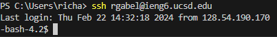
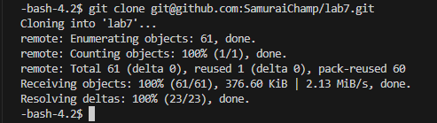

# Step 4
 
Keys pressed:`<up><enter>`  The `ssh rgabel@ieng6.ucsd.edu` command was 1 up in my history so I used the up arrow to get it.
# Step 5
 
Keys pressed:`<up><up><up><up><up><up><up><up><up><up><up><up><up><enter>` The `git clone git@github.com:SamuraiChamp/lab7.git` command was 13 up in my history so I used the up arrow to get it.
