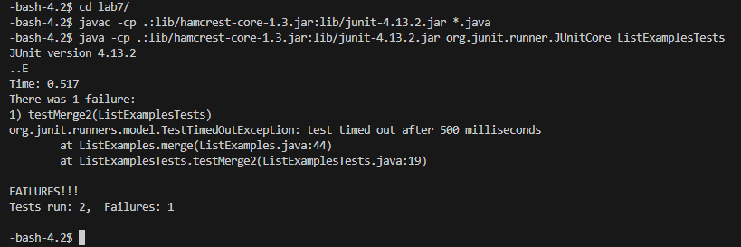
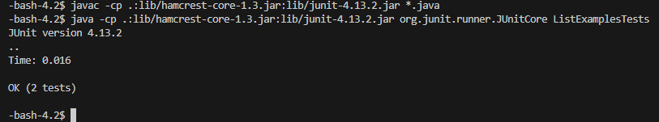
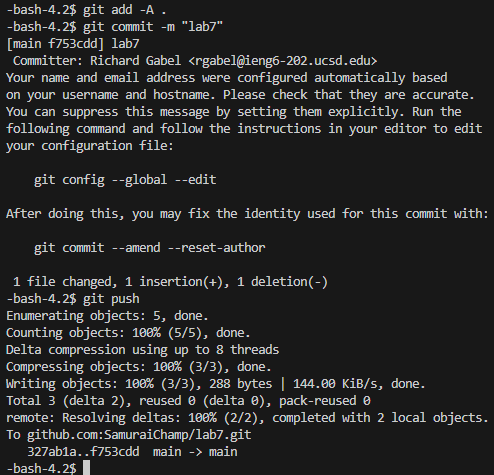

# Step 4
 
Keys pressed:`<up><enter>`  The `ssh rgabel@ieng6.ucsd.edu` command was 1 up in my history so I used the up arrow to get it.
# Step 5
 
Keys pressed:`<up><up><up><up><up><up><up><up><up><up><up><up><up><enter>` The `git clone git@github.com:SamuraiChamp/lab7.git` command was 13 up in my history so I used the up arrow to get it.
# Step 6
 
Keys pressed:`<up><up><up><up><up><up><up><up><up><up><up><up><up><enter>`, `<up><up><up><up><up><up><up><up><up><up><up><up><up><enter>` The `javac -cp .:lib/hamcrest-core-1.3.jar:lib/junit-4.13.2.jar *.java` was 13 up in my history so I used the up arrow to get that. Then the `java -cp .:lib/hamcrest-core-1.3.jar:lib/junit-4.13.2.jar org.junit.runner.JUnitCore ListExamplesTests` command was 13 up in my history so I did another 13 up to get that.
# Step 7
.png) 
.png) 
.png) 
Keys pressed:`<up><up><up><up><up><up><up><up><up><up><up><up><up><enter>`, `44<shift>gwhi<backspace>2<esc><shift>;wq<enter>` The `vim ListExamples.java` command was 13 up in my history so I accessed it with up. Once in vim, `44<shift>g` jumps to the first character on line 44, `wh` moves the cursor one word ahead and then one space to the left, `i<backspace>2<esc>` enters insert mode then deletes the 1 in `index1` then types a 2 then exits insert mode, `<shift>;wq<enter>` types `:wq` which is used to exit vim and save changes to the file
# Step 8
 
Keys pressed:`<up><up><up><enter>`, `<up><up><up><enter>` The `javac -cp .:lib/hamcrest-core-1.3.jar:lib/junit-4.13.2.jar *.java` was 3 up in my history so I used the up arrow to get that. Then the `java -cp .:lib/hamcrest-core-1.3.jar:lib/junit-4.13.2.jar org.junit.runner.JUnitCore ListExamplesTests` command was 3 up in my history so I did another 3 up to get that.
# Step 9
 
Keys pressed:`<up><up><up><up><up><up><up><up><up><up><up><up><up><enter>`, `<up><up><up><up><up><up><up><up><up><up><up><up><up><enter>`, `<up><up><up><up><up><up><up><up><up><up><up><up><up><enter>` The `git add -A command` 
