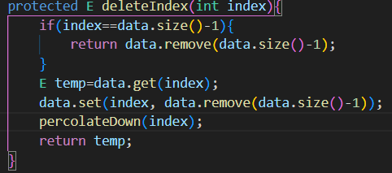
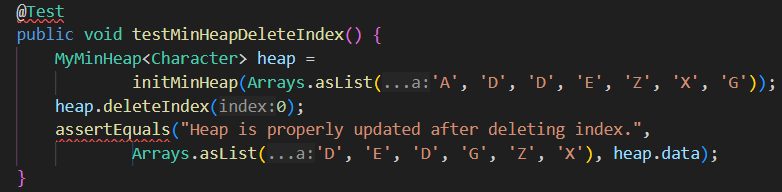
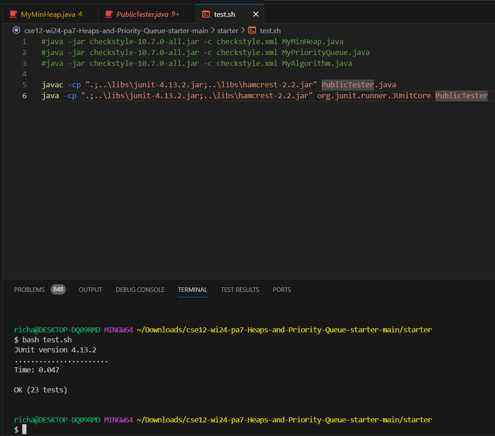

viewable at https://samuraichamp.github.io/cse15l-lab-reports/lab5
# Part 1: Debugging Scenario
## Student
Hello, I'm having an issue with my `deleteIndex` method as shown below 
 
I implemented this method using helped methods given to us as well as using the ArrayList<E> data made earlier.

`C:\Users\richa\Downloads\cse12-wi24-pa7-Heaps-and-Priority-Queue-starter-main\starter`

# Part 2: Reflection
