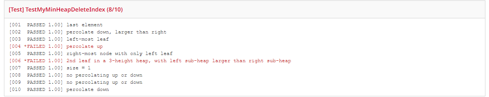

viewable at https://samuraichamp.github.io/cse15l-lab-reports/lab5
# Part 1: Debugging Scenario
## Student
Hello, I'm having an issue with my `deleteIndex` method as shown below 
 
I implemented this method using helper methods premade for us as well as using the ArrayList data made earlier. When I use the tests given to us, I get a pass as shown below 
 

# Part 2: Reflection
